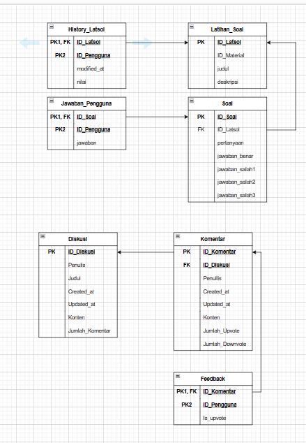

# REST Web Service

## Web Service pada REST ini menyediakan beberapa fitur berikut.

### 1. fitur diskusi

> Melihat daftar diskusi yang ada dan membuat diskusi baru bagi pengguna yang terverifikasi

### 2. fitur komentar

> Melihat komentar untuk diskusi tertentu dan memberikan komentar baru untuk diskusi tersebut bagi pengguna yang terverifikasi

### 3. fitur exercise

> Mengerjakan exercise yang terhubung dengan material plain webservice

### 4. fitur history exercise

> Melihat riwayat exercise yang dikerjakan dan summary singkatnya berupa nilai dan kunci jawaban

## Skema Basis Data

## Endpoint API

- Read All discussion: http://localhost:3000/discussion
- Create New discussion: http://localhost:3000/discussion/add
- Get Max page of discussion: http://localhost:3000/discussion/maxPage/:pageSize
- Read specific page in discussion: http://localhost:3000/discussion/page
- Read all comments on specific discussion: http://localhost:3000/discussion_view/:idDiskusi
- Create comment on specific discussion: http://localhost:3000/discussion_view/comment/add
- Get Max page of comments on specific discussion: http://localhost:3000/discussion_view/comment/:idDiskusi/maxPage
- Read specific page in comments on specific discussion: http://localhost:3000/discussion_view/comment/:idDiskusi/page
- Add upvote on comments: http://localhost:3000/discussion_view/comment/upvote/:id_komentar/:id_pengguna
- Add downvote on comments: http://localhost:3000/discussion_view/comment/downvote/:id_komentar/:id_pengguna
- Add downvote on comments: http://localhost:3000/discussion_view/comment/downvote/:id_komentar/:id_pengguna
- Check vote concistency on comments: http://localhost:3000/discussion_view/comment/confirmvote/:id_komentar/:id_pengguna
- Check number of vote: http://localhost:3000/discussion_view/comment/getvote/:id_komentar
- Get exercise history list of user: http://localhost:3000/exercise/getHistoryExerciseListById
- Get specific exercise history of user: http://localhost:3000/exercise/getHistoryExerciseById
- Read exercise: http://localhost:3000/exercise_task/:id
- Submit exercise: http://localhost:3000/exercise_task/:id/submit
- Login in SPA: http://localhost:3000/user/login
- Get User status by request to SOAP service: http://localhost:3000/user/userStatus/:ID_Pengguna
- Read All verification request connecting to SOAP service: http://localhost:3000/verification
- Verify the verification request connecting to SOAP service: http://localhost:3000/verification/updateStatus

## Pembagian Tugas

- Backend Fungsi read all discussion and page : 13521066
- Backend Fungsi add new discussion : 13521066
- Backend Fungsi read All comments : 13521066
- Backend Fungsi add new comments: 13521066
- Backend Fungsi get user verification status: 13521066
- Backend Fungsi upvote and downvote : 13521051
- Backend Fungsi read exercise: 13521051
- Backend Fungsi submit exercise: 13521051
- Backend Fungsi read exercise history list : 13521106
- Backend Fungsi read specific exercise: 13521106
- Backend Fungsi login : 13521106
